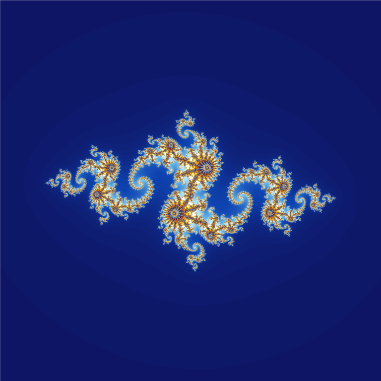

# Elementary

Version: [2025-07-05](https://kaimingtao.github.io/Elementary/)

## Rationale

In the complicated world, life is not simple, is it possible to **make things a bit easier, understandable, controllable?**

Things are complicated because things can go in diferent ways, and the number is large. As our mind are trying to model real world situations, we're trying to think many possibilities from different aspects, then something would reach beyond our minds' capability, and that feels hard. **Do some easier way exists?**, yes, some simple thinking tools can help us. For example we can ask **What is important information?**.

I find some elementary thinking tools from real life experience, based on them I can build tools to solve real world questions. I'd like to share with you and hope they can **help you build your thinking tools**.

The goal of this project is to provide a simple guideline that is easy to understand and follow. I'm trying to make it concise and communicate efficiently. Each thinking tool contains two parts, the main part contains key points for quick check, the attached link as second part describe reasons in detail you can check if you want.

There're many different ways to see these thinking tools. I'll try to illustrate them in different media. It helps me see things in different angles and refine them, second it trains my skill of communicating concisely. Balancing them simple for understanding is hard, I'll try.

## Life goals can be simple

- **Keep a clear mind**
    - eat well, sleep well
    - relax
- Find good purpose
- Adapt to environment
    - Keep the balance of life
    - don't go to self-destruction
- Make wishes carefully
    - the world can make wishes true, but also can misinterprete them
- Have fun in life!

## Communication is the basic skill

Communication is the basic skill for any kinds of work, make a clear plan, self communication, communicate with others, design a complex system, etc. That's because an entity no matter how small like an atom or large like a world is build by components, then coordinating by switching information, hence communication.

Expression is not communication, expression may not consider if other people can understand, but communication should. They're related.

## Solve hard questions by making them simple

Because any kind of complex object, no matter how large or how small, they're built from lower level items or concepts, so when we cannot handle something, we can try to catch parts of it, identify key information, build a mind model piece by piece, finally we can grasp some tricks or general methods. Also the process of breaking complex to simple, then rebuild from bottom to top is a natural way to be better.

## Set Goals

- Find something we want to try
    - hobbies, trends, borrowing from other people's idea, etc
- Try, Try, Try. We need some feedback from others, see some consequences. We want to know if we're thinking or doing in the right way. Are they what we expect or like or wish?
- Reevaluation our goals, if they're still what we want to do. If not, try a new one
- As we tried several times we may find something fits our way
- What we think and what we do defines who we're

## Understanding is simple

- Understanding is to build a model inside our mind
- Understanding is for doing something, achiving goals
- Starting with with some rough understanding and refine it during learning
    - For hard to understand things, split them to simple questions
    - Understanding is evloving during time.

- The mind model don't have to be perfect like a virtual game
    - The essential things are that help us do something or thinking now
    - all knowledge is for now, not for past, not for potential future, no matter its historical thing or future prediction thing
- The knowledge we know how to use is the thing we learnt
    - Memorizing is not understanding
    - Forgetting is ok, if we never use them or won't use them
    - As long as we know how to use knowledge to achieve our goal, it's ok.
    - We don't have to all everything, and we won't have enough time to do it.

- Different people understand things differently
    - partly because the world is big
    - partly because people see things from different angles
    - The difference between people matters when we work together
    - The world is big enough, build our ways of thinking
- Always there're different ways to see things
    - different narratives

## How to be better

- By spliting complex to simple, we can refine things easily
- Be careful, perfection for fitting to real world goals is good, perfection but don't know why is not good.

## Thinking cards

- [Note taking is for thinking](./Note-taking-is-for-thinking.md)

## Epilogue

- [Epilog](./Epilogue.md)
