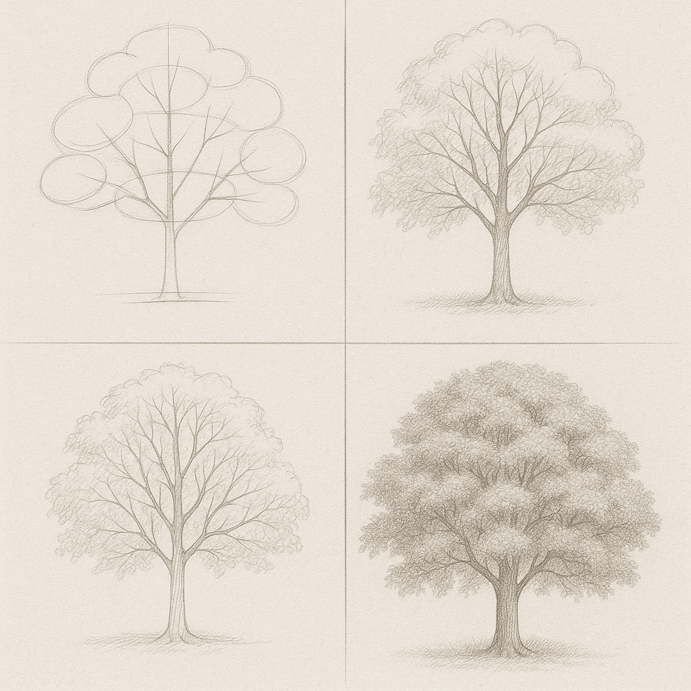

# Elementary

Version: [2025-07-02](https://kaimingtao.github.io/Elementary/)

## Rationale

In the complicated world, life is not simple, is it possible to **make things a bit easier, understandable, controllable?**

Things are complicated because things can go in diferent ways, and the number is large. As our mind are trying to model real world situations, we're trying to think many possibilities from different aspects, then something would reach beyond our minds' capability, and that feels hard. **Do some easier way exists?**, yes, some simple thinking tools can help us. For example we can ask **What is important information?**.

I find some elementary thinking tools in experience, based on them I can build tools to solve real world questions. I'd like to share with you and hope they can **help you build your thinking tools**.

The goal of this project is to provide a guideline that is easy to understand and follow. I'm trying to make it concise and communicate efficiently. Each thinking tool contains two parts, the main part contains key points for quick check, the attached link as second part describe reasons in detail you can check if you want.

There're many different ways to see these thinking tools. I'll try to illustrate them in different ways, first it helps me see things in different angles and refine them, second it trains my skill of communicating things concisely.

Have fun!

## Life goals can be simple

- Keep a clear mind
    - relax
- Find purpose
- Keep the balance of life
- Adapt to environment
- don't go to self-destruction

## Communication is the basic skill

Communication is the basic skill for any kinds of work, make a clear plan, self communication, communicate with others, design a complex system, etc. That's because an entity no matter how small like an atom or large like a world is build by components, then coordinating by switching information, hence communication.

Expression is not communication, expression may not consider if other people can understand, but communication should. They're related.

## Solve complex by simplify

Because any kind of complex object, no matter how large or how small, they're built from lower level items or concepts, so when we cannot handle something, we can try to catch parts of it, identify key information, build a mind model piece by piece, finally we can grasp some tricks or general methods. Also the process of breaking complex to simple, then rebuild from bottom to top is a natural way to be better.

## Refine is easy

By spliting complex to simple, we can refine things easily.

Generated by AI, this idea applies any thing you want to make it better. From structure to details.

- [How to be better](./how-to-be-better/how-to-be-better.md)

## Thinking toolkit

- [Note taking is for thinking](./Note-taking-is-for-thinking.md)
- [Thinker and Doer](./thinker-and-doer/thinker-and-doer.md)
