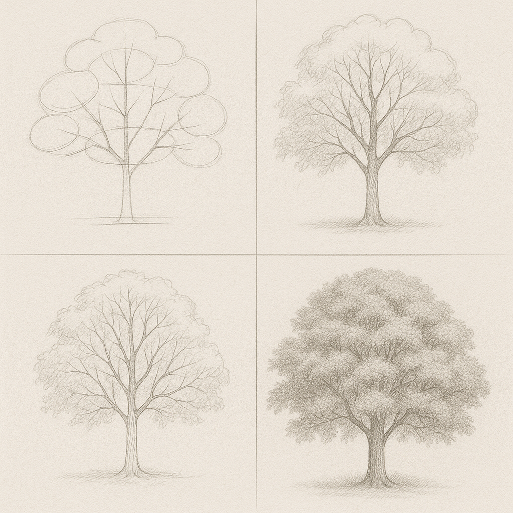

# Elementary

Version: 2025-05-27

This project is my thoughts about thinking methods that are some kind of general in life. Because they're general I'd consider they're elementary, like atoms in physical world, and pixels in virtual world. Using these basic methods one can create more ways of thinking.

Although these methods are statistically general, any time it's being applied in real life is a test if it really works. I'd prefer to call them life hacking method or life tricks, and always pay attention to other ways if they don't work.

I'm trying to make this project simple and clear, and I'm also trying to illustrate the concepts in different ways because:

1. it helps me review the ideas
2. different ways of presenting them provides new ways of thinking

My goals is to provide a guide for thinking without confusion. These methods are for solving some real life questions, trying to make a clear mind, and make good decisions. Life are complicated, I just want to make it a bit understandable, controlable, and easier.

## Simple goals in life

- Keep a clear mind
- Find goals
- Try and get feedback, and improve
- Relax and adjust self

## Content

- [Thinker and Doer](./thinker%20and%20doer/thinker%20and%20doer.md)
- [How to be better](./how%20to%20be%20better/how%20to%20be%20better.md)
- [Elementary questions](./elementary%20questions/elementary%20questions.md)

---

## General idea of refinement

Generated by AI, this idea applies any thing you want to make it better. From structure to details.
