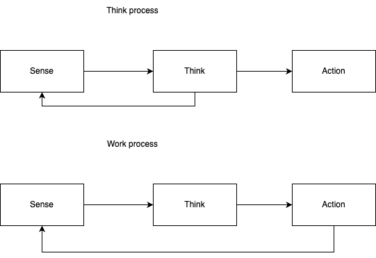

# Thinker and doer

A common idea is that thinker and doer are different types of people. But I have a new idea about what are their differences.

Simplest to say, thinker is focused more on the processing of data, less on actions. Doer is focused on doing something then checking it's feedback.

Doer is thinker, thinker is not doer.

